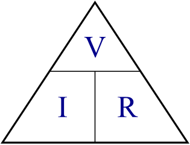

# Camping-Battery-Meter

Use this handy device to quickly determine what each device in your camping setup is using, which is great for calculating which solar panel you will need to keep the car or caravan battery charged over the long weekend.

## Bill of Materials

|Qty| Code | Description |
|---|---|---|
|1 | [XC3802](http://jaycar.com.au/p/XC3802) | ESP 8266
|2 | [ZR1398](http://jaycar.com.au/p/ZR1398) | 3v3 zener diode
|1 | [RR2550](http://jaycar.com.au/p/RR2550) | 100ohm resistor
|1 | [QP5410](http://jaycar.com.au/p/QP5410) | 5A shunt
|1 | [WC6026](http://jaycar.com.au/p/WC6026) | socket to socket jumper lead
|1 | [WH3057](http://jaycar.com.au/p/WH3057) | 7.5A 2 Core tinned cable
|1 | [PP2001](http://jaycar.com.au/p/PP2001) | fused cigarette plug
|1 | [PS2003](http://jaycar.com.au/p/PS2003) | cigarette socket
|1 | [HB6013](http://jaycar.com.au/p/HB6013) | enclosure
|1 | [HP0720](http://jaycar.com.au/p/HP0720) | 6.5mm waterproof glands

* Note, the cig plug used includes a 2-3A fuse, if you want to measure the full 5A, you should get a couple of [SF2166](https://jaycar.com.au/p/SF2166)

## Software and Libraries

* This uses the ESP8266, so you need to set up the ESP instructions in the Arduino IDE. You can do this by following the instructions in the manual on the [ESP8266 Product Page](http://jaycar.com.au/p/XC3802)

## Theory and Design

Before we get into the assembly side of things, we'll spend a quick minute on figuring out what we're doing.

The goal of the project is to measure a high amount of current going through the power cable, and to display that somewhere (we've opted for a phone).

###### How?

We have a few things in our mental toolbox that can assist with this. Firstly; we know that some microcontrollers, panel meters and analog displays use an "analog" voltage signal to measure voltage. This is measuring voltage, not current, so we can't just put our 5A of current right into the analog pin.

The second part of the problem comes to Ohm's law. We know that Voltage, Current, and Resistance is all related to each other through the `V = I * R` relation, but little resistors aren't going to handle 5A of current.

Our little ESP only takes 3.3V of analog voltage, so the only way we can get 5A down to 3.3V (doing `V/I = R` to find resistance) is through a "0.66" ohm resistor, which we don't have any on the shelf, and don't forget the power equation ( `Watts = Current (5A) * Voltage (3.3V)`) meaning that resistor will have to handle 16.5 Watts!

This isn't as difficult as it seems, as **current shunts** are exactly what this is designed for.

###### Current Shunts.

"Shunt" in a term, means to "divert" - here, we're going to divert the current away from our little measuring device (which will be the ESP) and continue back to the source. Current shunts are specialized to be of a certain resistance,  The shunt that we are using is a 5A shunt, which is rated at 50mV.

This means, for 5A of current, we'll read 50mV, or 1mV per 100mA of current, which is pretty good for what we'll be needing;

###### Interface and control system

In terms of control system; we have one analog reading that we'll need to display somehow. What if we wanted to log the result? or be able to "see" any spikes or waveforms present in the power feed?

For this we've opted to use an [ESP8266](https://jaycar.com.au/p/XC3802) module, presenting a wireless connection to a web-page, which will show all the correct information and readouts that we need, plus provide the opportunity to copy/paste the log reading into some other application, depending on whether it's our phone or computer connected.

the ESP is great because it does have at least one analogue pin, and the software libraries included with the board provide an easy access to do the above.

###### Voltage reading conversion

A word about voltage reading. If we look at the [datasheet](https://www.espressif.com/sites/default/files/documentation/0a-esp8266ex_datasheet_en.pdf) for the ESP8266, we can find that it only reads and converts up to 1V. *NB: (you can feed it more than this, but it won't do anything for the other 2.3V)*

We can also see that it is a 10-bit ADC, which means it can convert a voltage signal to be a value between 0-1024.

The process of converting a analog value to digital, such as 0.254546 Volts in the real word to a value that the ESP can process, is called quantization.

You can see a quick visual guide to what quantization is below: *(Images courtesy of  Hayacinth at Wikipedia)*

This is a two bit "analog to digital converter" (ADC) with 4 levels of voltage output, notice that small changes in voltages are completely wiped out, as the AD  doesn't have the resolution to read duch a small change, compared to a 3bit ADC:

Now, bigger changes can be tracked with more resolution of bits representing the changes.

Our ADC has a 10 bit resolution, which is pretty good resolution. with the "clamp" on 1v, we can find that:
`1V / 1024 values = 0.96765 mV` meaning a value of 1 corresponds to a voltage of 0.97 mV, or if we grace ourselves to round to 1mV, that equates about 100mA of current through the shunt! *(and a maxium of 102.4A, but the shunt couldn't handle that amount of current. this is the difference between practical and theoretical electronics.)*

###### Putting it all together

when we think about the layout of the circuit, we should start from the outside looking in. Consider the following schematic to be a representation of what we have if we just had a power-cable without shunts:

The load, we could think of as anything; a fridge, a light, something will *take* power from the battery. If it takes power, it takes current and voltage. The question is where should we put our shunt in this circuit?

[Kirchhoff's Voltage Law](https://www.electronics-tutorials.ws/dccircuits/kirchhoffs-voltage-law.html) comes into effect here. Simply put, the law states that voltages around a circuit add up to zero; so as a simple example, if you have a 5V source, and you put a 2v LED on it, that extra 3v has to go somewhere else, usually into some resistors (which regulates the flow of current, which is why they're called *current limiting resistors* ) otherwise they WILL go into the LED and cause damage.

**Fun fact:** This also gives rise to the reasoning behind *current is constant around a circuit,*  try it out with some batteries, resistors, and multimeters for yourself to check.

In our case, because we're only going to be considering a very small voltage drop across the shunt (the millivolts equations above). We have two options to put our shunt in, on the red line or the black line.

We're going on the black line, this is so the voltage drop across the shunt ( the **?v** above ) is with respect to 0, and going clockwise around the circuit, we can calculate

`12 - load(~12v) - shunt(~mV) = 0`.

If we put the shunt on the red line, the equation around the circuit would be.

`12v - shunt(~mV) - load(~12v) = 0`

meaning that the both ends of the shunt are higher than 0, and measuring across the shunt becomes too much of a task for our little 1V ESP.

Now we can be assured that the **?v** is going to be between some residual voltage after the load, and 0, we should be able to feed that into the ESP and see what we get, corresponding to the entire current going through the unit.

*Pretty nifty tricks, eh?*

###### Powering the ESP8266

We know that the power supply for the ESP8266 is around 3.3V nominal (datasheet and product page) so we need a 3.3V source to power this. but we only have 12, so how can we power it?

The answer comes down to a voltage divider circuit, and it works similarly to above. Very similar, infact.

This is a very common circuit used all throughout electronic engineering. suppose you have 2 voltage drops, `a` and `b` - and you want to find the voltage coming out between them. We've already done this sort of circuit but now we want a specific voltage coming out of the middle; if you suppose that both `a` and `b` are the same value, it would make sense that between 12V and 0V, the voltage would get halved, and `a` and `b` would have to both drop 6V.

Infact, as we saw before, to measure that voltage coming out, you would only have to know about the voltage drop across `b`, as it is tied to 0.

In this case, we want a voltage drop across b to be 3.3v; we could use resistors in the voltage divider equation: `Vout = Vin * R2 / (R1 + R2)` but this will only proportionally scale the voltage: If you set up the circuit to give 3.3V on 12, it will give 6.6V on 24V, and some other values for other voltages, which can damage the ESP.

In order to protect the circuit, and to give a nice clean 3.3V, we'll use a [Zener diode](https://www.evilmadscientist.com/2012/basics-introduction-to-zener-diodes/) such as our [ZR1398](http://jaycar.com.au/p/ZR1398) in place of b to give that 3.3V voltage drop, and thus voltage output.

Using the 3.3 zener here means that the other 8.7v must be dropped somewhere along this circuit (Kirchhoff's law, remember!) - we'll use a 100ohm Resistor, which, with Ohm's law, causes 87mA of current through the resistor and available for the ESP.

And, as the 3.3V zener is in place of B, we know that the voltage out will be 3.3V. Note that these are never ideal "regulator circuits" but for this theory lesson it should do fairly nicely.

In this circuit, we'll also use another zener on the A0, simply due to the fact that it can shunt away any voltage higher than 3.3V in the case of random spikes or shorts before the fuse kicks in.

Now we can start to understand the circuit as a whole: We get power from the 12v rail, "clamped" to 3.3v to power the ESP, the rest of the voltage then goes through the powered device ( if there is one)  and returns via the shunt, which we measure the voltage drop across ( due to ohms law ) which the ESP converts to a digital variable in software.

For reference:

#### What about the software?

The software is the other half of the design for this. We can get to that once we've built the unit.

## Assembly

## Programming

The software 
