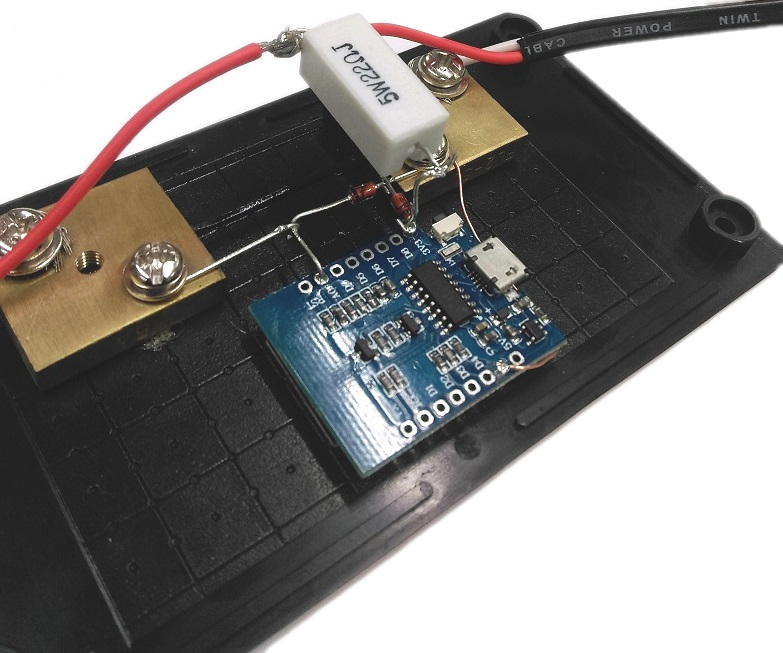

# Camping-Battery-Meter

This is more of an electronics lesson than anything else, We go over the fundamental electronics for building a complete circuit idea, discussing Ohm's law, Kirchhoff's law, analog and digital values, and the difference between website and embedded-C code.

This device is a simple current meter, set up so you can use it while camping to see what sort of power your 12v devices are using. The maximum current is recommended at 5A, however with a few minor tweaks you can easily change that.

Note that this project is designed to be more of a theory-lesson than a real practical unit. we have a [30A Current Module](https://jaycar.com.au/p/XC4610) and a [Regulator](https://jaycar.com.au/p/ZV1565) that can be used to make this a little more robust.

Consider reading through to get an understanding of the theory then using these additional components for a travel handy kit.

## Bill of Materials

|Qty| Code | Description |
|---|---|---|
|1 | [XC3802](http://jaycar.com.au/p/XC3802) | ESP 8266
|2 | [ZR1398](http://jaycar.com.au/p/ZR1398) | 3v3 zener diode
|1 | [RR3258](http://jaycar.com.au/p/RR3258) | 22ohm resistor
|1 | [QP5410](http://jaycar.com.au/p/QP5410) | 5A shunt
|1 | [WC6026](http://jaycar.com.au/p/WC6026) | socket to socket jumper lead
|1 | [WH3057](http://jaycar.com.au/p/WH3057) | 7.5A 2 Core tinned cable
|1 | [PP2001](http://jaycar.com.au/p/PP2001) | fused cigarette plug
|1 | [PS2003](http://jaycar.com.au/p/PS2003) | cigarette socket
|1 | [HB6013](http://jaycar.com.au/p/HB6013) | enclosure
|1 | [HP0720](http://jaycar.com.au/p/HP0720) | 6.5mm waterproof glands

* Note, the cig plug used includes a 2-3A fuse, if you want to measure the full 5A, you should get a couple of [SF2166](https://jaycar.com.au/p/SF2166)

* If you want to use the [ZV1565](https://jaycar.com.au/p/ZV1565) Regulator, you must take note that the max `voltage_in` is 5V. This means you will still need another step-down regulation (zener diode or regulator) to cut from 12V down to 5V, but the increased circuit complexity will give more *efficient* operation.

## Software and Libraries

* This uses the ESP8266, so you need to set up the ESP instructions in the Arduino IDE. You can do this by following the instructions in the manual on the [ESP8266 Product Page](http://jaycar.com.au/p/XC3802)

* We are also using the ESP8266 SPIF File System, you can set this up by first downloading the [ESP Tool](https://github.com/esp8266/arduino-esp8266fs-plugin/releases/download/0.1.3/ESP8266FS-0.1.3.zip) and placing it in your `Arduino/tools/` directory (or make one if it doesn't exist) - so the end result should look like `Arduino/tools/ESP8266FS/tool/xxx.jar`

## Theory and Design

Before we get into the assembly side of things, we'll spend a quick minute on figuring out what we're doing.

The goal of the project is to measure a high amount of current going through the power cable, and to display that somewhere (we've opted for a phone).

###### How?

We have a few things in our mental toolbox that can assist with this. Firstly; we know that some microcontrollers, panel meters and analog displays use an "analog" voltage signal to measure voltage. This is measuring voltage, not current, so we can't just put our 5A of current right into the analog pin.

The second part of the problem comes to Ohm's law. We know that Voltage, Current, and Resistance is all related to each other through the `V = I * R` relation, but little resistors aren't going to handle 5A of current.


Our little ESP only takes 3.3V of analog voltage, so the only way we can get 5A down to 3.3V (doing `V/I = R` to find resistance) is through a "0.66" ohm resistor, which we don't have any on the shelf, and don't forget the power equation ( `Watts = Current (5A) * Voltage (3.3V)`) meaning that resistor will have to handle 16.5 Watts!

This isn't as difficult as it seems, as **current shunts** are exactly what this is designed for.

###### Current Shunts

"Shunt" in a term, means to "divert" - here, we're going to divert the current away from our little measuring device (which will be the ESP) and continue back to the source. Current shunts are specialized to be of a certain resistance,  The shunt that we are using is a 5A shunt, which is rated at 50mV.


*Note, your shunt might look a little different*

This means, for 5A of current, we'll read 50mV, or 1mV per 100mA of current, which is pretty good for what we'll be needing;

###### Interface and control system

In terms of control system; we have one analog reading that we'll need to display somehow. What if we wanted to log the result? or be able to "see" any spikes or waveforms present in the power feed?

For this we've opted to use an [ESP8266](https://jaycar.com.au/p/XC3802) module, presenting a wireless connection to a web-page, which will show all the correct information and readouts that we need, plus provide the opportunity to copy/paste the log reading into some other application, depending on whether it's our phone or computer connected.

the ESP is great because it does have at least one analogue pin, and the software libraries included with the board provide an easy access to do the above.

###### Voltage reading conversion

A word about voltage reading. If we look at the [datasheet](https://www.espressif.com/sites/default/files/documentation/0a-esp8266ex_datasheet_en.pdf) for the ESP8266, we can find that it only reads and converts up to 1V. *NB: (you can feed it more than this, but it won't do anything for the other 2.3V)*

We can also see that it is a 10-bit ADC, which means it can convert a voltage signal to be a value between 0-1024.

The process of converting a analog value to digital, such as 0.254546 Volts in the real word to a value that the ESP can process, is called quantization.

You can see a quick visual guide to what quantization is below: *(Images courtesy of Hayacinth at Wikipedia)*


This is a two bit "analog to digital converter" (ADC) with 4 levels of voltage output, notice that small changes in voltages are completely wiped out, as the AD  doesn't have the resolution to read such a small change, compared to a 3bit ADC:


Now, bigger changes can be tracked with more resolution of bits representing the changes.

Our ADC has a 10 bit resolution, which is pretty good resolution. with the "clamp" on 1v, we can find that:
`1V / 1024 values = 0.96765 mV` meaning a value of 1 corresponds to a voltage of 0.97 mV, or if we grace ourselves to round to 1mV, that equates about 100mA of current through the shunt! *(and a maximum of 102.4A, but the shunt couldn't handle that amount of current. this is the difference between practical and theoretical electronics.)*

###### Putting it all together

when we think about the layout of the circuit, we should start from the outside looking in. Consider the following schematic to be a representation of what we have if we just had a power-cable without shunts:


The load, we could think of as anything; a fridge, a light, something will *take* power from the battery. If it takes power, it takes current and voltage. The question is where should we put our shunt in this circuit?

[Kirchhoff's Voltage Law](https://www.electronics-tutorials.ws/dccircuits/kirchhoffs-voltage-law.html) comes into effect here. Simply put, the law states that voltages around a circuit add up to zero; so as a simple example, if you have a 5V source, and you put a 2v LED on it, that extra 3v has to go somewhere else, usually into some resistors (which regulates the flow of current, which is why they're called *current limiting resistors* ) otherwise they WILL go into the LED and cause damage.

**Fun fact:** This also gives rise to the reasoning behind *current is constant around a circuit,*  try it out with some batteries, resistors, and multimeters for yourself to check.

In our case, because we're only going to be considering a very small voltage drop across the shunt (the millivolts equations above). We have two options to put our shunt in, on the red line or the black line.


We're going on the black line, this is so the voltage drop across the shunt ( the **?v** above ) is with respect to 0, and going clockwise around the circuit, we can calculate

`12 - load(~12v) - shunt(~mV) = 0`.

If we put the shunt on the red line, the equation around the circuit would be.

`12v - shunt(~mV) - load(~12v) = 0`

meaning that the both ends of the shunt are higher than 0, and measuring across the shunt becomes too much of a task for our little 1V ESP.

Now we can be assured that the **?v** is going to be between some residual voltage after the load, and 0, we should be able to feed that into the ESP and see what we get, corresponding to the entire current going through the unit.

*Pretty nifty tricks, eh?*

###### Powering the ESP8266

We know that the power supply for the ESP8266 is around 3.3V nominal (datasheet and product page) so we need a 3.3V source to power this. but we only have 12, so how can we power it?

The answer comes down to a voltage divider circuit, and it works similarly to above. Very similar, in fact.


This is a very common circuit used all throughout electronic engineering. suppose you have 2 voltage drops, `a` and `b` - and you want to find the voltage coming out between them. We've already done this sort of circuit but now we want a specific voltage coming out of the middle; if you suppose that both `a` and `b` are the same value, it would make sense that between 12V and 0V, the voltage would get halved, and `a` and `b` would have to both drop 6V.

In fact, as we saw before, to measure that voltage coming out, you would only have to know about the voltage drop across `b`, as it is tied to 0.

In this case, we want a voltage drop across b to be 3.3v; we could use resistors in the voltage divider equation: `Vout = Vin * R2 / (R1 + R2)` but this will only proportionally scale the voltage: If you set up the circuit to give 3.3V on 12, it will give 6.6V on 24V, and some other values for other voltages, which can damage the ESP.

In order to protect the circuit, and to give a nice clean 3.3V, we'll use a [Zener diode](https://www.evilmadscientist.com/2012/basics-introduction-to-zener-diodes/) such as our [ZR1398](http://jaycar.com.au/p/ZR1398) in place of b to give that 3.3V voltage drop, and thus voltage output.

Using the 3.3 zener here means that the other 8.7v must be dropped somewhere along this circuit (Kirchhoff's law, remember!) - we'll use a 22ohm Resistor, which, with Ohm's law, causes 395mA of current through the resistor and available for the ESP and zener diode.

And, as the 3.3V zener is in place of B, we know that the voltage out will be 3.3V. Note that these are never ideal "regulator circuits" but for this theory lesson it should do fairly nicely.

In this circuit, we'll also use another zener on the A0, simply due to the fact that it can shunt away any voltage higher than 3.3V in the case of random spikes or shorts before the fuse kicks in.


Now we can start to understand the circuit as a whole: We get power from the 12v rail, "clamped" to 3.3v to power the ESP, the rest of the voltage then goes through the powered device ( if there is one)  and returns via the shunt, which we measure the voltage drop across ( due to ohms law ) which the ESP converts to a digital variable in software.

For reference:


## Assembly

Assembling the unit is pretty easy, as we've done all the groundwork already.
First step is to cut the cable in half and make the plug and socket connections like so:


*Socket connection, using red for positive and white for negative.*


Similarly for the plug, we will put the red on the center pin position, with white on the outside. The green heat shrink is there as the red cable was accidently nicked while stripping, so we had to cover it up so it doesn't short anything else.

Remember to try and put the plug back together in the reverse order of how you pull it apart: Screw the two units together, then put on the crown, before sliding in the spring and screwing in the fuse.

The shunt has two screws underneath the unit, allowing you to remove the brass blocks from the plastic housing. We can remove this as we're using our own housing; you can hot-glue the brass and the ESP next to each other on the lid of the plastic enclosure, then start to solder it up much like the assembly picture.


Note in the picture above, we have a copper wire reaching from the power block, reaching over to ground, which is on the other side of the ESP. we then have the two zeners from the ground block to A0 and to 3v3 in.

Snip the leads of the zeners to make them fit nicely, and to also make a join reaching over from A0 to the other block.

Now you can drill a hole on either end of your case to put in the cable glands, and run the cable through them.

*(We didn't, below, to make it easier to see what the assembled unit should look like)*

Strip a large amount of sheath off the other end of the cables you have and attach the ground (which is the **white** connection) to the brass shunt blocks, and join the red wires together with one end of the resistor.



Here, the resistor is held above the shunt, via the thick lead running down into 3v3.


## Programming

The software for this comes in two separate parts; the code running on the ESP and the code in the browser. Conceptually it looks like this:


#### ESP8266 code

Firstly, the ESP handles the connections to and from the phone, and handles all the WiFi connectivity, when the phone asks for a website (which is `10.0.0.7/index.html` by default) the ESP sends the website code to the phone.

###### Access point IP address
You will find, near the top of the code:

```c
IPAddress			apIP(10,0,0,7);	//our access point ip
```
This sets up the IP address to be had by the access point when we run the server, and it corresponds to an IP address of `10.0.0.7` -- you can change this variable to any IP address that you want, you will just have to remember it to put into the phone later.

###### Delivering the website to the phone

The website is handled by the code below, *(some parts omitted for brevity)*

```c
ESP8266WebServer server(80);

void setup(){
	//here we define a server mountpoint; when the user accesses current, we send them the text data
	server.on("/current", [](){
		text = (String)data;
		server.send(200, "text/html", text);
	});

	//otherwise, if we can't find anything ( in our mountpoints) we then call the fileRead function
	server.onNotFound([](){
		if(!fileRead(server.uri())){
			server.send(404, "text/html", "<h1>404 File not found on SPIFFS</h1>");
		}
	});
}
void loop(){
  server.handleClient();
}
```

This code first sets up `/current` as a server mount point; which means when the user accesses /current on our website, the ESP will run this code to convert the data into a String representation and send it back to the user.

Next we define a `noNotFound()` function, which kicks in when the user requests a site or page that we have not defined above. More about this function below.

This code first converts the `data` variable into a string/text format, and then sends it over the web-connection.
Back in the loop, we simply set the data being the reading from analogRead:

```c
void loop(){
  // etc
  data = analogRead(A0);
}
```

#### Website code

Now that the ESP delivers our webpage, we want more than just a simple static number to represent whatever the reading was at that point of time. Firstly we'll build a bit of a webpage with html code, and then fill it out and update it with JavaScript.

HTML and JavaScript code is handled by the phone; as such, you could almost think of it as the ESP is sending these "commands" to the phone. the HTML provides the layout and structure of the website, and the JavaScript provides the functionality: what to do when a button is clicked, and so on.

There's quite a bit more processing power on the phone rather than the tiny ESP8266 module, so anything involving strings or floats or interesting data operations like that are best handled on the phone/JavaScript side of things.

```html
<body>
	<center>
		<h1>Jaycar</h1>
		<h1>Current reading: <span id='reading'>0</span></h1>
		<h2> Average over <span id='sec'></span> seconds: <span id='average'>0</span></h2>
		<canvas id='chart' width='300px;' height='100px;' style='border: 1px solid black;'> </canvas>
		<div class='form'>
			<button id='capture'>Capture</button>
			<input type='checkbox' id='checkbox'>Auto-log</input>
			<button id='copier'>Copy to clipboard</button>
			<br/>
			<textarea id='log' cols='40' rows='60' readonly='true'></textarea>
		</div>
	</center>
</body>
```

Here we're using a *canvas* element so that we can draw a graph, as well as a textarea for the log data, and some buttons.

In javascript, we'll now get the elements and assign some dynamic information:

```javascript
window.onload = function(){
  function asyncRead(url,func){ /**/ };
  function updateData(data){ /**/ };
  function updatePage(data){ /**/ };

  //ommited for brevity
	var reading_span = document.getElementById('reading');
	var seconds_span = document.getElementById('sec');
	seconds_span.innerText = time_scale;
	var button = document.getElementById('capture');
  // etc

	button.onclick = function(){
	};

	checkbox.onclick = function(){
		if (checkbox.checked == true){
      //etc
		}else{
      //etc
		}
	}
	setInterval(function(){
    asyncRead('current',updateData)
  }, 500);
}
```

We've cut out a lot of the code to make the general layout more prominent.

1. Firstly, we set this function to be on page load, so once the page has fully finished loading, it will then run this JavaScript code.

2. We'll make some functions called `asyncRead` to read and process the data from the `/current` webpage on the same domain as this webpage. as well as `updateData` to keep track of an array of data, and `updatePage` to show up on the html site.

3. We'll get some handles for the elements on the page, thankfully we've given them each an id, so we can just use the `document.getElementById()` function to get a javascript handle to that particular element with id.

4. With the button and checkbox, we'll set an "onclick" function, so when the users click on these elements, it will run these functions.

5. Finally, we'll use the `setInterval(function,time);` JavaScript call, so that the phone will call this function, every 500ms; this is so the page will automatically refresh with new information, as each 500ms `asyncRead` will be called, updating the stored data and then updating the page.

###### Putting the website onto the ESP

Previously the only way to get the website code onto the ESP8266 would be to either include it in a large one-line string variable ( and taking up flash space) or to solder on a little SD card module and read from the FAT32 file system, which is a huge task in and of itself.

Thankfully the guys at Expressif (Makers of the ESP8266 Codebase) have created **SPIFFS** - SPI Flash File System - which can be used to place all our website data, and easily called into the program code.

Once you have the tool installed, (Checking the **Software and Libraries** section above) you should see a new option when you select "Tool" in the Arduino IDE:


*ESP8266 Sketch Data Upload*

This will upload the "data" folder in the sketch folder into the ESP's memory.


From this, we can use separate files for our JavaScript, HTML, and CSS, and we don't have to worry about putting it into a c-string.

Every time you change your website code, you will have to re-upload data. In our code, we hijack the "onNotFound" function to look in our SPIFFS for a particular filename, and stream that.

```c
	//here we define a server mountpoint; when the user accesses current, we send them the text data
	server.on("/current", [](){
		text = (String)data;
		server.send(200, "text/html", text);
	});

	//otherwise, if we can't find anything ( in our mountpoints) we then call the fileRead function
	server.onNotFound([](){
		if(!fileRead(server.uri())){
			server.send(404, "text/html", "<h1>404 File not found on SPIFFS</h1>");
		}
	});
```
The only "mount point" we define is the `/current` - anything else will be deemed as not found, in which the `fileRead()` function will try to find it the FS, and if so, stream that instead of returning the 404 message.

* For instance, when the phone requests "index.html" - because we have not defined a "index.html" mount point, it will fall back to the `onNotFound` function, which calls `fileRead`.

`fileRead` then looks for the file on the SPIFFS and streams it.

```c

bool fileRead(String filepath){
	if( SPIFFS.exists(filepath) ) {
		File f = SPIFFS.open(filepath, "r");
		server.streamFile(f, contentType(filepath));
		f.close();
		return true;
	}
	return false;
}
```
Note, for the web-browser to handle it correctly, we must also define the `contentType`, which is another custom function that is made in the source code. This simply checks if the file ends in .html, and returns `"text/html"` - and so on for .js and .css files too.

## Programming

When programming, be sure to change the flash size to "4M (1M SPIFFS)" which will portion a size of the memory to use with SPIFFS.

## Use
Use is easy enough, look on your phone for a new network and connect to it.
From there, if you open up the web browser and navigate to `10.0.0.7` or whatever IP address you set above in the IP address section.
